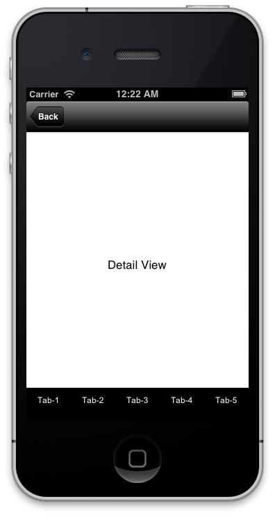
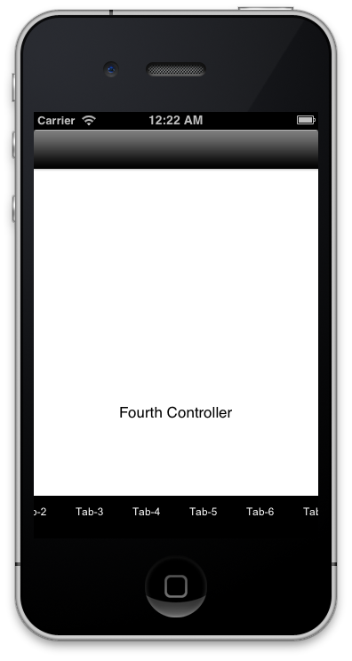

CustomTabBar
============

This is a custom scrollable tab bar which can be used as a base project template or as a sample example to create other similar component. 
Story board is used in this example template. 

Video:
================
http://youtu.be/2-HcdK_Sdmw

Screen Shots:
================

Customization:
================

Setting root controller other than first tab

    //  BaseViewController.m
    
    -(void)setup {
    ...
    ...
    
    // Select which view to be loaded (actually viewed) as base controller or root controller. 0 - BaseController, 1 -
    // FirstTabController, 2 - SecondTabcontroller
    // By default first tab controller is set a rootcontroller
    
    [self tabCall:1];
    }
    
Adding more tabs or if want to remove?
    
    See the BaseViewController.m 
    Add new controller files and inherit from UIViewController. Add appropriate methods, tabs, set title, and import relevant classes.
    You can follow the code written for other tabs. If you want to delete then just delete the files and remove the appropriate code.
    
    
LICENSE: 
================

Copyright (c) 2013 Mohit Jain.

Permission is hereby granted, free of charge, to any person obtaining a copy
of this software and associated documentation files (the "Software"), to deal
in the Software without restriction, including without limitation the rights
to use, copy, modify, merge, publish, distribute, sublicense, and/or sell
copies of the Software, and to permit persons to whom the Software is
furnished to do so, subject to the following conditions:

The above copyright notice and this permission notice shall be included in
all copies or substantial portions of the Software.

THE SOFTWARE IS PROVIDED "AS IS", WITHOUT WARRANTY OF ANY KIND, EXPRESS OR
IMPLIED, INCLUDING BUT NOT LIMITED TO THE WARRANTIES OF MERCHANTABILITY,
FITNESS FOR A PARTICULAR PURPOSE AND NONINFRINGEMENT. IN NO EVENT SHALL THE
AUTHORS OR COPYRIGHT HOLDERS BE LIABLE FOR ANY CLAIM, DAMAGES OR OTHER
LIABILITY, WHETHER IN AN ACTION OF CONTRACT, TORT OR OTHERWISE, ARISING FROM,
OUT OF OR IN CONNECTION WITH THE SOFTWARE OR THE USE OR OTHER DEALINGS IN
THE SOFTWARE.

NOTE:
===============

If you use this component, please send me an email on majainmail@gmail.com. 
I will be glad to hear that. 
